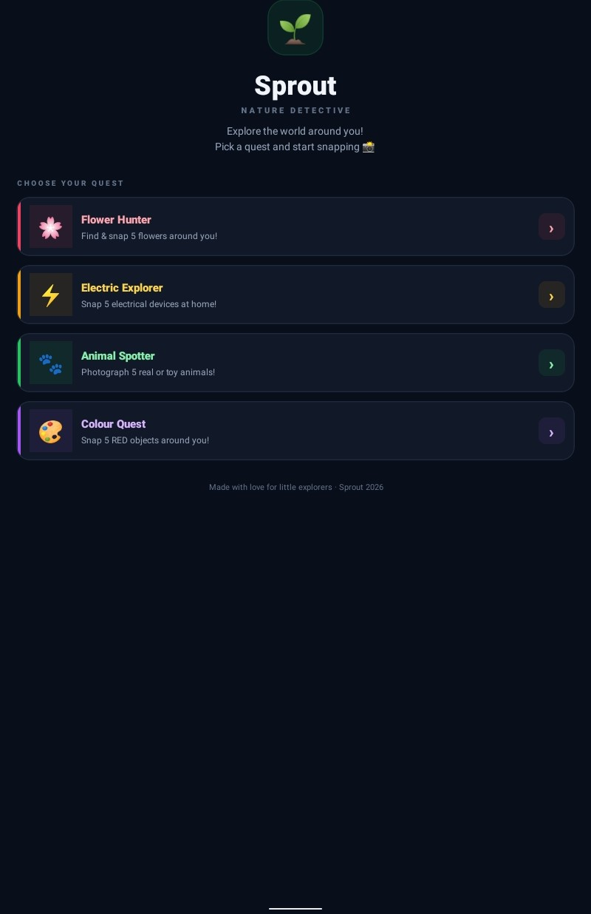

# 📷 Kids Learning Camera App

An interactive educational mobile application for children aged 3–8 years built using React Native and Expo.

## Features

* 📸 Camera Integration
* 🔍 Object Identification and Labeling
* 🎁 Reward-Based Learning Experience
* 👶 Child-Friendly User Interface
* 📱 Mobile-First Design
* ⭐ Interactive Learning Activities

## Screenshots

### Home Screen



### Camera Activity


### Reward Screen


## Tech Stack

* React Native
* Expo
* JavaScript

## Installation

```bash
npm install
npx expo start
```

## Project Overview

Kids Learning Camera App is an interactive learning application that encourages children to explore their surroundings through camera-based activities. Children can capture objects, receive instant labels, and earn rewards for successfully completing learning challenges. The application combines learning and exploration in a fun and engaging way.

## Folder Structure

files (2)/
│
├── screenshots/
│   ├── home.jpeg
│   ├── camera.jpeg
│   └── reward.jpeg
│
├── SproutDetective/
├── App.js
├── app.json
├── babel.config.js
├── package.json
└── README.md


## Author
Nisha
